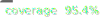

<p align="center">
    
    
    
</p>

# go-xerrors

Simple library for code-based errors enriched with data and metadata.

## Features

- Create simple errors with custom codes and data
- Wrap underlying errors preserving the original
- Aggregate multiple errors together
- Pure Go implementation, no external dependencies

## Installation

```bash
go get github.com/alse-zubkov/go-xerrors VERSION
```

## Quick Start

```go
import "github.com/alse-zubkov/go-xerrors"

// Create error code with metadata (optional)
var code := xerrors.NewCode("example", xerrors.Data{"field": "description"})

func foo() error {
    // Use code as base to create an error with data (optional)
    return xerrors.New(code, xerrors.Data{"key": "value"})
}

err := foo()
```

## How to use (API)

Main types and interfaces:
* `type Data map[string]any` is used to store _metadata_ and _data_
* `type CodeKey any` is an identifier for error codes
* `type Code interface` represents an error code with a `CodeKey` and _metadata_
* `type Type string` the type of an error (_Simple_, _Wrapper_, _Aggregator_)
* `type Error interface` represents an error with `Code`, `Type`, and _data_

Main functions:
* `NewCode()` to create error code with `CodeKey` and _metadata_
* `New()`, `Wrap()`, `Aggregate()` to create new error with corresponding `Type`

## Error Codes

Each error code has a unique key that identifies it. All errors with the same code belong to the same family and are considered comparable. Error comparison is performed exclusively through the code key - errors are equal if their codes are equal.

It is recommended to use a plain string as the code key.

Code metadata is a flexible structure that stores additional information for the error family. For example, HTTP status code to return, human-readable message, description, or any other relevant data.

## Error Types

### Simple Error

Simple errors are created with `New()` to create a new error from scratch.

```go
code := xerrors.NewCode("entity-not-found", nil)
err := xerrors.New(
    code,
    xerrors.Data{
        "entity-type": "user", 
        "entity-id": 123,
    },
)
```

Find more examples [here](examples/).

### Wrapped Error
Wrapped errors are created with `Wrap()` to preserve and chain underlying errors. Supports `errors.Unwrap()` for error traversal.

```go
code := xerrors.NewCode("entity-not-found", nil)
err := xerrors.Wrap(
    code,
    xerrors.Data{
        "entity-type": "user", 
        "entity-id": 123,
    },
    errors.New("no rows")
)
```

Find more examples [here](examples/).

### Aggregated Errors
Aggregated errors are created with `Aggregate()` to collect multiple related errors together, such as validation errors from multiple fields.
```go
xerrs := []xerrors.Error{
    xerrors.New(CodeFieldRequired, xerrors.Data{"field": "name"}),
    xerrors.New(CodeFieldWrongValue, xerrors.Data{"field": "id", "expected-format":"uuid"}),
}
aggError := xerrors.Aggregate(
    CodeManifestInvalid,
    xerrors.Data{},
    xerrs...,
)
```

Find more examples [here](examples/).